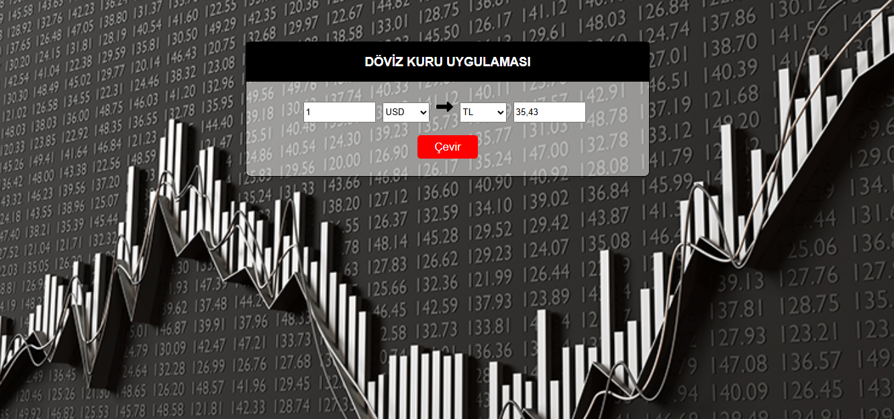

# React + Vite

## Döviz Kuru Uygulaması

*Bu proje, ReactJS kullanılarak geliştirilen temel bir döviz dönüştürme uygulamasıdır. Kullanıcılar, iki para birimi seçerek dönüşüm yapabilir ve sonucu anında görüntüleyebilir. Uygulama, döviz kurlarını FreeCurrencyAPI kullanarak gerçek zamanlı olarak alır.*

- ReactJS: Kullanıcı arayüzü geliştirmek için.
- CSS: Basit stil düzenlemeleri.
- Axios: API istekleri için





API Bilgisi 🔗
Bu proje, döviz kurlarını almak için FreeCurrencyAPI kullanmaktadır. API'yi kullanmak için aşağıdaki adımları izleyin:

1. FreeCurrencyAPI adresine giderek kaydolun.
2. API anahtarınızı oluşturun.
3. Projede .env dosyanıza ekleyin:

```csharp
    VITE_API_KEY=your_api_key_here
```